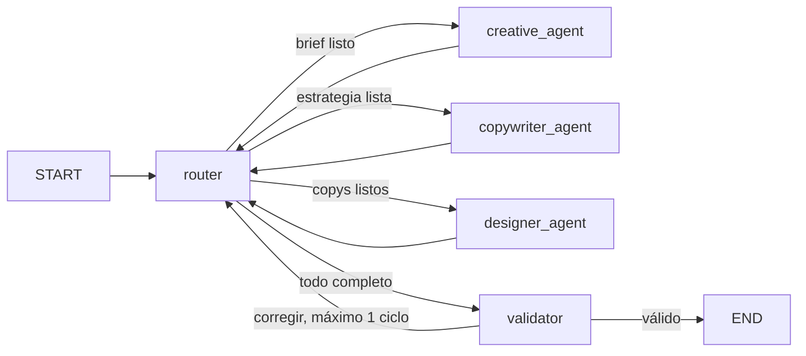

# Especificación para Codex: multiagente publicitario Cafe.AI

## Objetivo

Implementa un sistema multiagente local con **Python, LangGraph y Ollama** que genere la primera campaña publicitaria de Cafe.AI para redes sociales.

El sistema debe incluir exactamente estas responsabilidades:

1. **Enrutador/supervisor:** estructura el brief, decide el siguiente agente, valida y consolida la respuesta.
2. **Creativo:** crea la estrategia y el concepto rector.
3. **Redactor:** produce textos adaptados a redes sociales.
4. **Diseñador:** entrega dirección de arte y prompts visuales; no genera imágenes.

Debe funcionar tanto como aplicación de consola en Python como mediante un notebook demostrativo.

## Contexto de marca

Cafe.AI es un café de barrio donde convergen tecnología y sabor. Está orientado a innovadores, desarrolladores, trabajadores remotos, estudiantes, creadores y soñadores. Ofrece un ambiente pensado para conectar, conversar, trabajar y desarrollar ideas alrededor de un café de calidad.

La comunicación debe ser innovadora, cercana, inteligente y optimista. No se deben inventar precios, descuentos, ubicaciones, fechas, características tecnológicas ni servicios no proporcionados por el usuario.

## Decisiones técnicas obligatorias

- Lenguaje: Python 3.10 o superior.
- Orquestación: `langgraph` mediante `StateGraph`.
- Modelo: Ollama local mediante `langchain-ollama`.
- Modelo predeterminado: `llama3.2:latest`, actualmente disponible localmente.
- Temperatura predeterminada: `0.2`.
- Configuración mediante variables de entorno, sin secretos en el código.
- Interfaz 1: script ejecutable desde consola.
- Interfaz 2: notebook Jupyter que reutilice el código Python; no duplicar la lógica del grafo.
- Salidas internas y finales estructuradas con Pydantic.
- El diseñador solo crea especificaciones y prompts visuales.

## Selección del modelo Ollama

Usa este orden:

1. Valor de la variable `OLLAMA_MODEL`.
2. `llama3.2:latest` si está instalado.
3. Primer modelo retornado por la API local de Ollama.
4. Si Ollama no está activo o no existen modelos, mostrar un error accionable y finalizar limpiamente.

Modelos detectados al preparar esta especificación:

- `llama3.2:latest`
- `gemma4:latest`
- `tinyllama:latest`

No descargues modelos automáticamente.

## Arquitectura del grafo

Implementa un enrutador real como nodo del grafo. Los especialistas deben regresar al enrutador, que examina el estado y decide el paso siguiente.



El enrutamiento no debe depender de texto libre. Debe usar campos explícitos del estado y valores enumerados como `creative`, `copywriter`, `designer`, `validator` y `end`.

Limita la corrección automática a un ciclo para evitar bucles infinitos. Configura además un `recursion_limit` razonable.

## Estado compartido

Define `CampaignState` con `TypedDict`. Como mínimo debe contener:

```python
class CampaignState(TypedDict):
    messages: Annotated[list, add_messages]
    user_request: str
    brief: dict | None
    creative_strategy: dict | None
    copywriting: dict | None
    visual_design: dict | None
    validation_notes: list[str]
    revision_count: int
    next_agent: str
    final_campaign: dict | None
```

Cada nodo solo debe actualizar los campos que le corresponden. No reemplazar accidentalmente el historial de `messages`.

## Modelos de salida

Crea modelos Pydantic separados para validar los contratos entre agentes.

### `CampaignBrief`

- `objective`
- `audience`
- `channels`
- `tone`
- `constraints`

Valores predeterminados cuando el usuario no los especifique:

- Canales: Instagram, TikTok y LinkedIn.
- Tono: innovador, cercano y optimista.
- Tipo: campaña orgánica de lanzamiento.

### `CreativeStrategy`

- `campaign_name`
- `insight`
- `value_proposition`
- `big_idea`
- `slogan`
- `tone`
- `content_pillars`

### `SocialPost`

- `channel`
- `objective`
- `hook`
- `body`
- `call_to_action`
- `hashtags`

Debe existir una publicación para Instagram, una para TikTok y una para LinkedIn.

### `VisualPiece`

- `channel`
- `format`
- `dimensions`
- `composition`
- `color_palette`
- `typography`
- `visual_prompt`
- `negative_prompt`
- `accessibility_alt_text`

El `visual_prompt` debe ser autocontenido y corresponder al copy del mismo canal. No debe solicitar que un generador de imágenes reproduzca textos largos; los textos se agregan posteriormente en diseño.

### `FinalCampaign`

- `brief`
- `creative_strategy`
- `social_posts`
- `visual_pieces`
- `publication_schedule`
- `kpis`
- `validation_notes`

## Comportamiento de los agentes

### Enrutador/supervisor

- En la primera ejecución, transforma la solicitud en `CampaignBrief`.
- Determina la siguiente fase revisando qué campos estructurados están completos.
- No redacta los resultados propios de los especialistas.
- Después de las tres especialidades, deriva al validador.
- Tras validación exitosa, crea `final_campaign` y finaliza.

### Agente creativo

- Lee el brief completo.
- Produce una sola estrategia unificadora y viable.
- Evita conceptos genéricos sin relación con café, comunidad o creatividad tecnológica.
- Devuelve únicamente un `CreativeStrategy` válido.

### Agente redactor

- Lee el brief y la estrategia creativa.
- Genera exactamente tres piezas iniciales: Instagram, TikTok y LinkedIn.
- Adapta extensión, gancho y tono a cada canal.
- Incluye CTA y hashtags relevantes sin saturación.
- No inventa promociones ni datos comerciales.

### Agente diseñador

- Lee brief, estrategia y copys.
- Produce una especificación visual para cada publicación.
- Incluye formato, dimensiones, composición, paleta, tipografía, prompt positivo, prompt negativo y texto alternativo.
- No llama a APIs de imágenes ni afirma que una imagen fue generada.

### Validador

Comprueba al menos:

- Presencia de los cuatro roles en el flujo.
- Un concepto rector consistente.
- Una pieza completa por cada canal requerido.
- Correspondencia entre copy y propuesta visual.
- CTA medible en cada publicación.
- Ausencia de datos comerciales inventados.
- Campos Pydantic completos.

Si detecta errores, guarda notas concretas e indica al enrutador qué agente debe corregir. Permite solo una ronda de corrección. Si persisten errores, entrega el mejor resultado disponible e incluye las observaciones pendientes, sin ocultarlas.

## Prompts de sistema

Guarda los prompts en un módulo independiente. Cada prompt debe:

- Definir claramente el rol y sus límites.
- Indicar cuáles campos de entrada puede utilizar.
- Exigir salida en el esquema Pydantic correspondiente.
- Prohibir datos no presentes en el brief.
- Estar escrito en español.

No mezclar las funciones de los agentes dentro de un único prompt.

## Estructura de archivos requerida

```text
cafe_ai_agents/
├── __init__.py
├── config.py
├── models.py
├── prompts.py
├── agents.py
├── graph.py
├── formatter.py
└── cli.py
notebooks/
└── cafe_ai_demo.ipynb
tests/
├── test_router.py
├── test_models.py
└── test_graph.py
.env.example
.gitignore
README.md
requirements.txt
```

Responsabilidades:

- `config.py`: configuración y selección segura del modelo local.
- `models.py`: contratos Pydantic y estado.
- `prompts.py`: instrucciones de cada rol.
- `agents.py`: funciones de nodos especialistas y validador.
- `graph.py`: construcción y compilación de `StateGraph`.
- `formatter.py`: conversión de `FinalCampaign` a Markdown legible.
- `cli.py`: entrada por argumento o modo interactivo.
- Notebook: demostración importando el paquete.

## Interfaz de consola

Debe admitir:

```bash
python -m cafe_ai_agents.cli
python -m cafe_ai_agents.cli --brief "Crear campaña de lanzamiento para Cafe.AI"
python -m cafe_ai_agents.cli --brief-file brief.txt --output campaign.md
python -m cafe_ai_agents.cli --model llama3.2:latest
```

Requisitos:

- Mostrar avance conciso por agente, sin imprimir razonamiento interno del modelo.
- Imprimir la campaña final en Markdown.
- Con `--output`, guardar el mismo resultado en UTF-8.
- Usar códigos de salida diferentes de cero ante errores de configuración o conexión.

## Notebook

El notebook debe:

1. Verificar dependencias y conexión con Ollama.
2. Mostrar el modelo elegido.
3. Importar el grafo desde `cafe_ai_agents`; no redefinir agentes.
4. Ejecutar un brief de ejemplo de Cafe.AI.
5. Mostrar el diagrama del grafo si la dependencia lo permite.
6. Renderizar la campaña final como Markdown.

No incluir `pip install` incondicional dentro del flujo principal. Si se incluye una celda de instalación, dejarla comentada y documentada.

## Dependencias

Incluye únicamente las necesarias y evita fijar versiones incompatibles. Como base:

```text
langgraph
langchain-core
langchain-ollama
pydantic
python-dotenv
jupyter
pytest
```

Documenta las versiones finalmente probadas en el README o congélalas después de verificar la ejecución.

## Pruebas

Las pruebas automatizadas no deben requerir que Ollama esté activo. Usa un modelo falso o monkeypatch para probar:

- Orden normal: enrutador → creativo → redactor → diseñador → validador.
- Salto correcto al siguiente agente según los campos del estado.
- Validación de los modelos Pydantic.
- Límite de una corrección.
- Generación del Markdown final.
- Mensaje claro cuando Ollama no está disponible.

Añade además una prueba manual opcional, documentada y separada, que sí invoque `llama3.2:latest`.

## README

Documenta en español:

- Propósito y arquitectura.
- Requisitos: Python y Ollama.
- Cómo iniciar Ollama y comprobar modelos con `ollama list`.
- Instalación en entorno virtual.
- Variables de entorno disponibles.
- Uso por consola y notebook.
- Ejemplo de entrada y resumen de salida.
- Cómo ejecutar pruebas.
- Limitación explícita: el diseñador entrega prompts, no imágenes.

Incluye `.env.example`:

```dotenv
OLLAMA_MODEL=llama3.2:latest
OLLAMA_BASE_URL=http://127.0.0.1:11434
MODEL_TEMPERATURE=0.2
```

## Criterios de aceptación

- El proyecto se instala sin modificar el código fuente.
- Se selecciona un modelo Ollama disponible y se informa cuál se usa.
- El grafo contiene enrutador, creativo, redactor, diseñador y validador.
- El enrutador toma decisiones mediante estado estructurado.
- La campaña final contiene estrategia, tres copys y tres prompts visuales.
- La CLI y el notebook reutilizan la misma implementación.
- El sistema termina incluso si una corrección no resuelve todos los errores.
- No se generan imágenes ni se requieren servicios externos.
- Las pruebas unitarias funcionan sin Ollama.
- El README permite reproducir la ejecución desde cero.

## Verificación antes de entregar

Codex debe ejecutar, corregir y reportar:

```bash
python -m compileall cafe_ai_agents
pytest -q
python -m cafe_ai_agents.cli --help
ollama list
```

Si Ollama está activo, ejecutar además una prueba real breve con `llama3.2:latest`. No ocultar fallos: indicar qué se verificó, qué no pudo verificarse y la causa exacta.

## Fuera de alcance

- Generación real de imágenes.
- Publicación automática en redes sociales.
- Compra de publicidad o integración con cuentas externas.
- Persistencia en base de datos.
- Interfaz web.
- Descarga automática de modelos Ollama.
